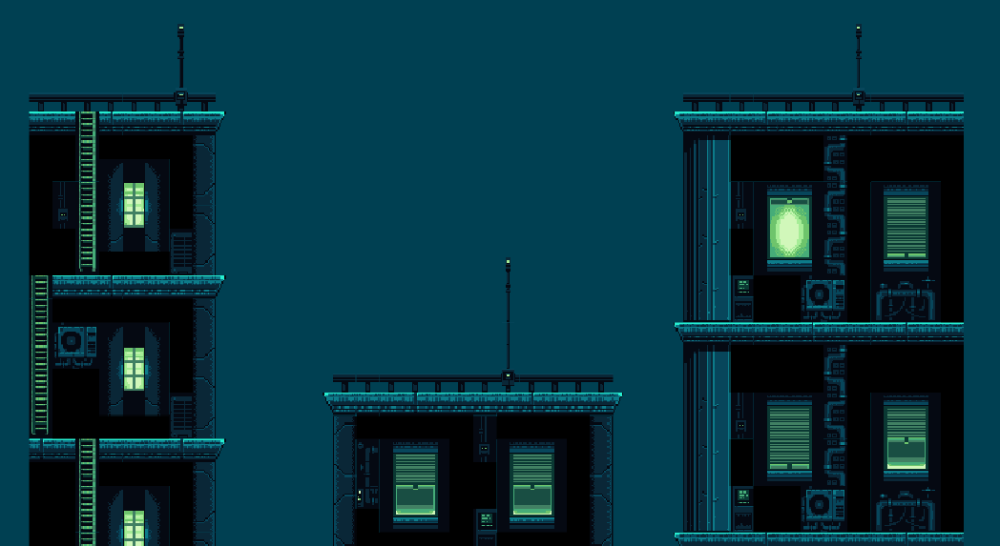

# Overview

## UI

### Design

The design of the game utilized several asset sets, character asset sets, object asset sets, input assets, and background assets. the character assets objects and input assets were obtained from free or purchased assets from Unity while the background assets were created through COPIOLET AI generation and photo manipulation. COPIOLET was prompted for various pixel art background specifications and the images were refined until they matched a desired outcome. then they were taken into a photo editor to mirror aspects of the images to make them tileable. the backgrounds were then added to scenes and further adjusted to make them distinct from the scene objects. this might involve adding color changes in Unity or returning to the photo editor to make additional changes such as hue or saturation. A key aspect was matching the color scheme of the scene assets to the background but also making the background distinct from the scene assets to allow users to make the distinction.

The input assets such as forms, buttons, text inputs and fonts were made using simplePixelart asset set which is an asset of sprites and fonts that matched the design aspect of our game. In addition to the assets, some design aspects were done inside the unity editor such as color, gradients, and opacity.

## Maps

Cave


Nirmata-Hidden


DonkyKong


NewYork


Earth


Gold


All maps were created specialy for this project using free assets from the Unity Asset Store.

## Movement

### Movement Scripts

There are two scripts that control each player. More specifically PhotonView is used to determine which player is being control by a specific user. The CharacterController script works to handle specific events for the player such as flipping the character, crouching events, and jumping events. The PlayerMovement scripts works to take in the user inputs and handles the movement. It also works to call the player animations based on the inputs.
Look at the CharacterController script here: [Character Controller](Nirmata-Mahasura/Assets/Scripts/PlayerScripts/CharacterController2D.cs)
Look at the PlayerMovement script here:
[Player Movement](Nirmata-Mahasura/Assets/Scripts/PlayerScripts/PlayerMovement.cs)

### Movement Animations

Sprites for animations are free assets and were taken from itch.io. The animations play based on different parameters created in the unity animator. There are multiple animations implemented to each character inluding idle, run, jump, crouch, take damage, and die.

## Health and Damage

### Scripts

The Health and Damage scripts use simple math to upkeep the remaining health for any given player.  The difficulty with these scripts comes with the fact that we are constantly trying to pass our updated health back and forth between every player.  To do this we ended up using an RPC function that updates a users health across the other computers in the network.

```C#
[PunRPC]
    void UpdateHealthRPC(int health)
    {
        currentHealth = health;
        if (currentHealth > 0)
        {   
            healthBar.UpdateHealthBar(currentHealth, maxHealth);
        }
        else
        {
            Die();
        }
    }
```

This code is called every couple seconds, which is something that needs to be changed in future iterations of the project.  The RPC call really only needs to be called every time something takes damage.  Right now we are sending out blank RPC calls to every computer in the network every few seconds, which is causing a lot of jittering and slowness.

We have a bullet prefab that changes player health script when it impacts with the parent object.  We simply subtract a set amount of damage from the health script then we call the above RPC function to update across the network.

```C#
 void OnTriggerEnter2D(Collider2D hitInfo)
    {
        Health enemy = hitInfo.GetComponent<Health>();
        if (enemy != null)
        {
            enemy.TakeDamage(damage);
        }
        Destroy(gameObject);
    }
```

### Health Bar

Tutorial Video
[Simple Health Bar](https://youtu.be/_lREXfAMUcE?si=X5_GZbss-xG3mH48)
[How to Make the Health Bar Interactable with A Character's Health](https://youtu.be/0tDPxNB2JNs?si=GqMcURyH8-TU7vBO)

In the HealthBar class, it only updates the health bar. You can call it in Health.cs file to display
the health change anytime like when a character gets damage or healed.

``` C#
public class HealthBar : MonoBehaviour
{
    public Image healthBar;
    public void UpdateHealthBar(float currentValue, float maxValue)
    {
        healthBar.fillAmount = currentValue / maxValue;
    }
}
```

## Camera

The Camera Script allows the Camera to act using different functions. Most importantly, the Camera will attach itself to the "Active" player. The active player will always be the player being controlled, so on each computer the active player will be different. Once there is no more active player, the camera will switch to a stagnant position overviewing the whole map. This allows players who have been defeated to see the rest of the living players until the game eventually ends.

```C#
    void Update()
    {
        FindPlayer();
        transform.LookAt(target);
        transform.position = target.position + offset;
        transform.rotation = Quaternion.Euler(Vector3.zero);
    }

    void FindPlayer()
    {
        try
        {
        GameObject findPlayer;
        findPlayer = GameObject.FindGameObjectWithTag("Player");
        target = findPlayer.transform;
        cam.orthographicSize = playerSize;
        }
        catch
        {
            GameObject findCenter;
            findCenter = GameObject.FindGameObjectWithTag("Center");
            target = findCenter.transform;
            cam.orthographicSize = centerSize;
        }
    }

```

Connected to the idea of the Camera script is the UpdateTag script, which allows the game to figure out which mode the Camera should be set into. The UpdateTag script is applied to each player Prefab and tells the player to update their tage to "Player" when it detects that they are the host of their machine. This player tag is what signifies an active player to the Camera script.

```C#
void Start()
    {
        if(photonView.IsMine){
            gameObject.tag = "Player";
        }
    }
```

## Server Management

{Important! Do not say in this section that this is college assignment.}

{Provide a description of your team project. Describe how to use the software.}

# Development Environment

{Describe the tools that you used to develop the software}

{Describe the programming language that you used and any libraries.}

# Collaborators

Uplandwave - [Github](https://github.com/uplandwave)

Samuel Mickelsen - [Github](https://github.com/Sammickelsen)

Rai Katsuragawa - [Github](https://github.com/katsu-rai)

Gilber Chen - [Github](https://github.com/ooioioogt)

Kyle Guo - [Github](http://github.com/kyleguo123)

James Call

Levi Johnson

# Useful Websites

- [Unity Asset Store](https://assetstore.unity.com/)
- [Web Site Name](http://url.link.goes.here)

# Future Work

{Make a list of things that you need to fix, improve, and add in the future.}

- Design: Add layered backgrounds and animations to the backgrounds, add button press animations
- Maps: Fix all tearing. Two way colliders.
- Item 3
